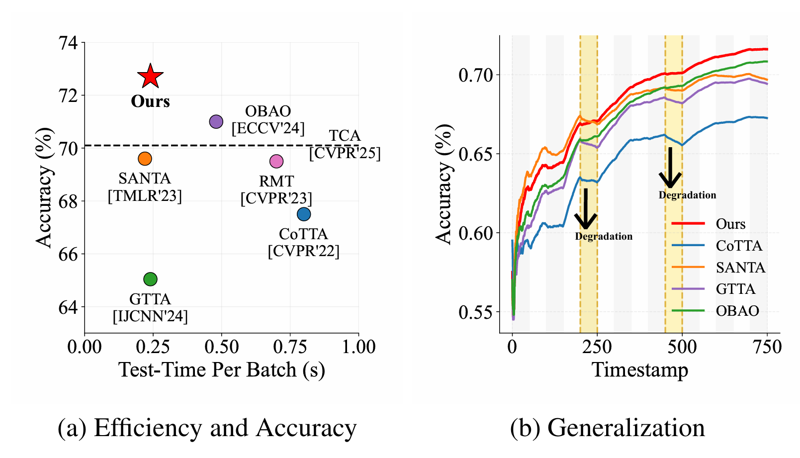
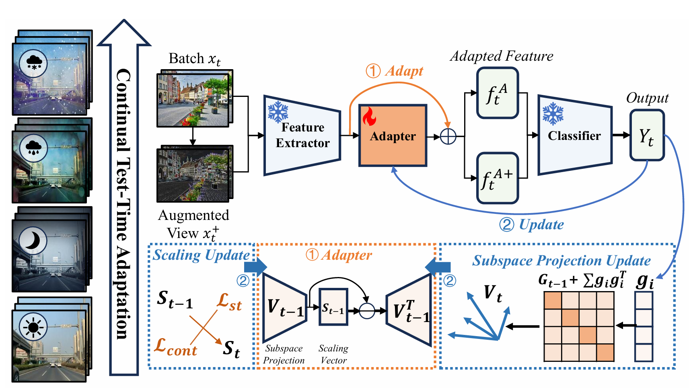
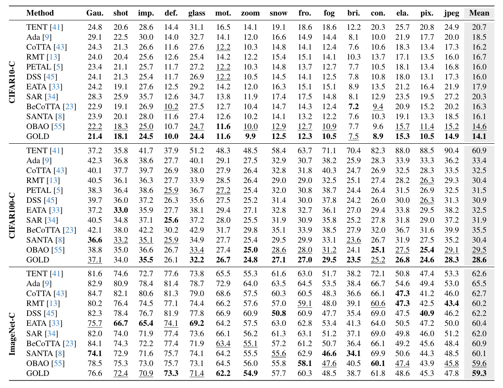
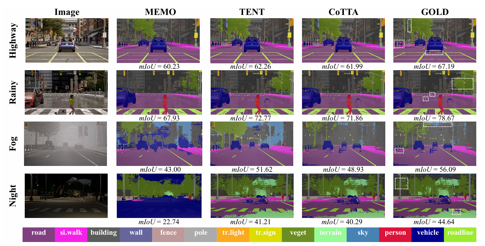

## The Golden Subspace: Where Efficiency Meets Generalization in Continual Test-Time Adaptation

---

<p align="center">
  <a href=""></a>
  <a href=""></a>
  <a href=""></a>
  <a href=""></a>
  <a href=""></a>
</p>
<p align="center">
  <a href="https://www.lamda.nju.edu.cn/laign/">Guannan Lai</a> ·
  <a href="https://www.lamda.nju.edu.cn/zhoudw/">Da-Wei Zhou</a> ·
  <a href="https://zhenguol.github.io/">Zhenguo Li</a> ·
  <a href="https://www.lamda.nju.edu.cn/yehj/">Han-Jia Ye</a>
</p>

<p align="center">  Official implementation of <b>GOLD</b>, a continual test-time adaptation framework that performs efficient online adaptation in a low-rank classifier-sensitive subspace.</p>

## 🎉 Introduction

Continual test-time adaptation (CTTA) aims to continuously adapt a pre-trained model to evolving target environments without accessing source data. While recent methods have shown promising gains, they often face a fundamental trade-off: stronger adaptation usually requires updating more parameters, which increases online optimization cost and may even hurt long-term robustness under continuously shifting distributions. As a result, achieving both effectiveness and efficiency in CTTA remains challenging.

In this work, we revisit CTTA from the perspective of adaptation space. Instead of updating high-dimensional features or a large number of model parameters, we ask a simple question: *is there a compact subspace that is sufficient for effective test-time adaptation?* Our answer is yes. As illustrated below, although target data may drift continuously over time, effective adaptation can be carried out within a small yet expressive subspace, which we call the **golden subspace**. Building on this insight, we propose **GOLD**, a lightweight and efficient CTTA framework that dynamically identifies and exploits this subspace for online adaptation, leading to strong performance with minimal trainable parameters and low computational overhead.

<div align="center">
  
</div>

## ✨ GOLD

GOLD is built on the key observation that effective continual test-time adaptation does not require updating the full feature space. Instead, there exists a compact subspace that is sufficient for adaptation, which we term the **golden subspace**. Based on this insight, GOLD performs online adaptation by projecting target features into this low-dimensional subspace and learning only a lightweight scaling vector, significantly reducing the adaptation cost while preserving strong adaptation capability.

<div align="center">
  
</div>

Concretely, GOLD consists of two alternating stages: **adapt** and **update**. In the adapt stage, frozen backbone features are projected onto the golden subspace and then recalibrated through a residual low-rank transformation parameterized by the scaling vector. In the update stage, GOLD dynamically estimates the golden subspace from incoming target data using the Average Gradient Outer Product (AGOP), and updates the scaling vector with self-training and prototype-based contrastive objectives. In this way, GOLD enables efficient and effective adaptation under continuously evolving test distributions.

## 📚 Citation

If you find this repo useful, please consider citing:

```bibtex
@inproceedings{lai2026golden,
  title     = {The Golden Subspace: Where Efficiency Meets Generalization in Continual Test-Time Adaptation},
  author    = {Lai, Guannan and Zhou, Da-Wei and Li, Zhenguo and Ye, Han-Jia},
  booktitle = {CVPR},
  year      = {2026}
}
```

## ☄️ How to Use

To use the repository, we provide a conda environment.

```bash
conda update conda
conda env create -f environment.yml
conda activate tta 
```

#### Classification

<details open>
<summary>Features</summary>

This repository contains an extensive collection of different methods, datasets, models, and settings,
which we evaluate in a comprehensive benchmark (see below). We also provide a tutorial on how to use this 
repository in combination with CLIP-like models [here](classification/tutorials/tutorial_clip.md). 
A brief overview of the repository's main features is provided below:


- **Datasets**
  - `cifar10_c` [CIFAR10-C](https://zenodo.org/record/2535967#.ZBiI7NDMKUk)
  - `cifar100_c` [CIFAR100-C](https://zenodo.org/record/3555552#.ZBiJA9DMKUk)
  - `imagenet_c` [ImageNet-C](https://zenodo.org/record/2235448#.Yj2RO_co_mF)
  - `imagenet_a` [ImageNet-A](https://github.com/hendrycks/natural-adv-examples)
  - `imagenet_r` [ImageNet-R](https://github.com/hendrycks/imagenet-r)
  - `imagenet_v2` [ImageNet-V2](https://huggingface.co/datasets/vaishaal/ImageNetV2/tree/main)
  - `imagenet_k` [ImageNet-Sketch](https://github.com/HaohanWang/ImageNet-Sketch)
  - `imagenet_d` [ImageNet-D](https://github.com/bethgelab/robustness/tree/main/examples/imagenet_d)
  - `imagenet_d109`
  - `domainnet126` [DomainNet (cleaned)](http://ai.bu.edu/M3SDA/)
  - `Continually Changing Corruptions` [CCC](https://github.com/oripress/CCC)

- **Models**
  - For adapting to ImageNet variations, all pre-trained models available in [Torchvision](https://pytorch.org/vision/stable/models.html) or [timm](https://github.com/huggingface/pytorch-image-models?tab=readme-ov-file#models) can be used.
  - For the corruption benchmarks, pre-trained models from [RobustBench](https://github.com/RobustBench/robustbench) can be used.
  - For the DomainNet-126 benchmark, there is a pre-trained model for each domain.
  - Further models include [ResNet-26 GN](https://github.com/zhangmarvin/memo).
  - It is also possible to use the models provided by [OpenCLIP](https://github.com/mlfoundations/open_clip/tree/main).

- **Settings**
  - `reset_each_shift` Reset the model state after the adaptation to a domain.
  - `continual` Train the model on a sequence of domains without knowing when a domain shift occurs.
  - `gradual` Train the model on a sequence of gradually increasing/decreasing domain shifts without knowing when a domain shift occurs.
  - `mixed_domains` Train the model on one long test sequence where consecutive test samples are likely to originate from different domains.
  - `correlated` Same as the continual setting but the samples of each domain are further sorted by class label.
  - `mixed_domains_correlated` Mixed domains and sorted by class label.
  - Combinations like `gradual_correlated` or `reset_each_shift_correlated` are also possible.


- **Mixed Precision Training**
  - Almost all of the aforementioned methods (except SAR and GTTA) can be trained with mixed precision. This greatly 
    speeds up your experiments and requires less memory. However, all benchmark results are generated with fp32.

- **Modular Design**
  - Adding new methods should be rather simple, thanks to the modular design.

</details>

<details open>
<summary>Get Started</summary>

To run one of the following benchmarks, the corresponding datasets need to be downloaded.

- *CIFAR10-to-CIFAR10-C*: the data is automatically downloaded.
- *CIFAR100-to-CIFAR100-C*: the data is automatically downloaded.
- *ImageNet-to-ImageNet-C*: for non source-free methods, download [ImageNet](https://www.image-net.org/download.php) and [ImageNet-C](https://zenodo.org/record/2235448#.Yj2RO_co_mF).
- *ImageNet-to-ImageNet-A*: for non source-free methods, download [ImageNet](https://www.image-net.org/download.php) and [ImageNet-A](https://github.com/hendrycks/natural-adv-examples).
- *ImageNet-to-ImageNet-R*: for non source-free methods, download [ImageNet](https://www.image-net.org/download.php) and [ImageNet-R](https://github.com/hendrycks/imagenet-r).
- *ImageNet-to-ImageNet-V2*: for non source-free methods, download [ImageNet](https://www.image-net.org/download.php) and [ImageNet-V2](https://huggingface.co/datasets/vaishaal/ImageNetV2/tree/main).
- *ImageNet-to-ImageNet-Sketch*: for non source-free methods, download [ImageNet](https://www.image-net.org/download.php) and [ImageNet-Sketch](https://github.com/HaohanWang/ImageNet-Sketch).
- *ImageNet-to-ImageNet-D*: for non source-free methods, download [ImageNet](https://www.image-net.org/download.php). For [ImageNet-D](https://openreview.net/pdf?id=LiC2vmzbpMO), see the download instructions for DomainNet-126 below. ImageNet-D is created by symlinks, which are set up at the first use.
- *ImageNet-to-ImageNet-D109*: see instructions for DomainNet-126 below.
- *DomainNet-126*: download the 6 splits of the [cleaned version](http://ai.bu.edu/M3SDA/). Following [MME](https://arxiv.org/abs/1904.06487), DomainNet-126 only uses a subset that contains 126 classes from 4 domains.
- *ImageNet-to-CCC*: for non source-free methods, download [ImageNet](https://www.image-net.org/download.php). CCC is integrated as a webdataset and does not need to be downloaded! Please note that it cannot be combined with settings such as correlated.

After downloading the missing datasets, you may need to adapt the path to the root directory `_C.DATA_DIR = "./data"` 
located in the file `conf.py`. For the individual datasets, the directory names are specified in `conf.py` as a dictionary (see function `complete_data_dir_path`). 
In case your directory names deviate from the ones specified in the mapping dictionary, you can simply modify them.

</details>

<details open>
<summary>Run Experiments</summary>

We provide config files for all experiments and methods. Simply run the following Python file with the corresponding config file.

```bash
python test_time.py --cfg cfgs/[ccc/cifar10_c/cifar100_c/imagenet_c/imagenet_others/domainnet126]/[source/norm_test/norm_alpha/tent/memo/rpl/eta/eata/rdumb/sar/cotta/rotta/adacontrast/lame/gtta/rmt/roid/tpt/tca].yaml
```

For imagenet_others, the argument `CORRUPTION.DATASET` has to be passed:

```bash
python test_time.py --cfg cfgs/imagenet_others/[source/norm_test/norm_alpha/tent/memo/rpl/eta/eata/rdumb/sar/cotta/rotta/adacontrast/lame/gtta/rmt/roid/tpt].yaml CORRUPTION.DATASET [imagenet_a/imagenet_r/imagenet_k/imagenet_v2/imagenet_d109]
```

E.g., to run ROID for the ImageNet-to-ImageNet-R benchmark, run the following command.

```bash
python test_time.py --cfg cfgs/imagenet_others/roid.yaml CORRUPTION.DATASET imagenet_r
```

Alternatively, you can reproduce our experiments by running the `run.sh` in the subdirectory `classification/scripts`.
For the different settings, modify `setting` within `run.sh`.

To run the different continual DomainNet-126 sequences, you have to pass the `MODEL.CKPT_PATH` argument. 
When not specifying a `CKPT_PATH`, the sequence using the *real* domain as the source domain will be used.
The checkpoints are provided by [AdaContrast](https://github.com/DianCh/AdaContrast) and can be downloaded [here](https://drive.google.com/drive/folders/1OOSzrl6kzxIlEhNAK168dPXJcHwJ1A2X). 
Structurally, it is best to download them into the directory `./ckpt/domainnet126`.

```bash
python test_time.py --cfg cfgs/domainnet126/rmt.yaml MODEL.CKPT_PATH ./ckpt/domainnet126/best_clipart_2020.pth
```

For GTTA, we provide checkpoint files for the style transfer network. The checkpoints are provided on 
Google-Drive ([download](https://drive.google.com/file/d/1IpkUwyw8i9HEEjjD6pbbe_MCxM7yqKBq/view?usp=sharing)); 
extract the zip-file within the `classification` subdirectory.

</details>

<details open>
<summary>Changing Configurations</summary>

Changing the evaluation configuration is extremely easy. For example, to run TENT on ImageNet-to-ImageNet-C 
in the `reset_each_shift` setting with a ResNet-50 and the `IMAGENET1K_V1` initialization, the arguments below have to be passed. 
Further models and initializations can be found [here (torchvision)](https://pytorch.org/vision/stable/models.html) or [here (timm)](https://github.com/huggingface/pytorch-image-models?tab=readme-ov-file).

```bash
python test_time.py --cfg cfgs/imagenet_c/tent.yaml MODEL.ARCH resnet50 MODEL.WEIGHTS IMAGENET1K_V1 SETTING reset_each_shift
```

For ImageNet-C, the default image list provided by robustbench considers 5000 samples per domain 
(see [here](robustbench/data/imagenet_test_image_ids.txt)). If you are interested in running experiments on the full
50,000 test samples, simply set `CORRUPTION.NUM_EX 50000`, i.e. 

```bash
python test_time.py --cfg cfgs/imagenet_c/roid.yaml CORRUPTION.NUM_EX 50000 
```

</details>

####  Segmentation

For running the experiments based on CarlaTTA, you first have to download the dataset splits as provided below. 

+ clear [download](https://drive.google.com/file/d/19HUmZkL5wo4gY7w5cfztgNVga_uNSVUp/view?usp=sharing)
+ day2night [download](https://drive.google.com/file/d/1R3br738UCPGryhWhJE-Uy4sCJW3FaVTr/view?usp=sharing)
+ clear2fog  [download](https://drive.google.com/file/d/1LeNF9PpdJ7lbpsvNwGy9xpC-AYlPiwMI/view?usp=sharing)
+ clear2rain [download](https://drive.google.com/file/d/1TJfQ4CjIOJtrOpUCQ7VyqKBVYQndGNa_/view?usp=sharing)
+ dynamic [download](https://drive.google.com/file/d/1jb1qJMhOSJ48XUQ7eRqT7agnDK9OBwox/view?usp=sharing)
+ dynamic-slow [download](https://drive.google.com/file/d/1RTciKaw2LhlQ4ecKMlarSKyOzsDgaurT/view?usp=sharing)
+ clear-highway [download](https://drive.google.com/file/d/1lZlxwBVBSBAguONX9K6gI2NlWqAxECvB/view?usp=sharing)
+ highway [download](https://drive.google.com/file/d/1Q_3iOuDK4t-W3lvsHwRddDqHTE8GEAIj/view?usp=sharing)

Again, you probably have to change the data directory `_C.DATA_DIR = "./data"` in `conf.py`. Further, you have to download the pre-trained source checkpoints ([download](https://drive.google.com/file/d/1PoeW-GnFr374j-J76H8udblSwrae74LQ/view?usp=sharing)) and extract the zip-file within the `segmentation` subdirectory.

E.g., to run GTTA, use the config file provided in the directory `cfgs` and run:

```
python test_time.py --cfg cfgs/gtta.yaml
```

You can also change the test sequences by setting `LIST_NAME_TEST` to:

+ day2night: `day_night_1200.txt`
+ clear2fog: `clear_fog_1200.txt`
+ clear2rain: `clear_rain_1200.txt`
+ dynamic: `dynamic_1200.txt`
+ highway: `town04_dynamic_1200.txt`

If you choose highway as the test sequence, you have to change the source list and the corresponding checkpoint paths.

```bash
python test_time.py --cfg cfgs/gtta.yaml LIST_NAME_SRC clear_highway_train.txt LIST_NAME_TEST town04_dynamic_1200.txt CKPT_PATH_SEG ./ckpt/clear_highway/ckpt_seg.pth CKPT_PATH_ADAIN_DEC = ./ckpt/clear_highway/ckpt_adain.pth
```

## 📊 Results

GOLD achieves strong performance across both continual test-time classification and segmentation benchmarks. On image classification, GOLD consistently outperforms prior CTTA methods under continuously evolving corruptions, achieving the best average error on CIFAR10-C, CIFAR100-C, and ImageNet-C. These results show that restricting adaptation to the golden subspace is not only highly parameter-efficient, but also remarkably effective in maintaining robustness under long-term distribution shifts.

<div align="center">
  
</div>

GOLD also generalizes well to dense prediction tasks. On continual test-time semantic segmentation, it delivers superior or highly competitive performance across multiple dynamic scenarios, including challenging transitions such as day-to-night, clear-to-fog, and highway environments. Together, these results demonstrate that GOLD provides a unified and efficient solution for continual adaptation across diverse vision tasks.

<div align="center">
  
</div>

## 👨‍🏫 Acknowledgments

We thank the following repos/projects for helpful components:

+ Robustbench [official](https://github.com/RobustBench/robustbench)
+ CoTTA [official](https://github.com/qinenergy/cotta)
+ TENT [official](https://github.com/DequanWang/tent)
+ AdaContrast [official](https://github.com/DianCh/AdaContrast)
+ EATA [official](https://github.com/mr-eggplant/EATA)
+ RoTTA [official](https://github.com/BIT-DA/RoTTA)
+ SAR [official](https://github.com/mr-eggplant/SAR)
+ RDumb [official](https://github.com/oripress/CCC)
+ CMF [official](https://openreview.net/forum?id=BllUWdpIOA&noteId=FbQwbITFM0)
+ DeYO [official](https://github.com/Jhyun17/DeYO)
+ TPT [official](https://github.com/azshue/TPT)
+ TCA  [official](https://github.com/Successybbdwm/TCA)
+ CarlaTTA [official](https://github.com/Jo-wang/TTA)

## 🤗 Contact

For questions and feedback, please open an issue or contact:

- Guannan Lai ([laign@lamda.nju.edu.cn](mailto:laign@lamda.nju.edu.cn))

------

[](https://star-history.com/#AIGNLAI/GOLD&Date)

